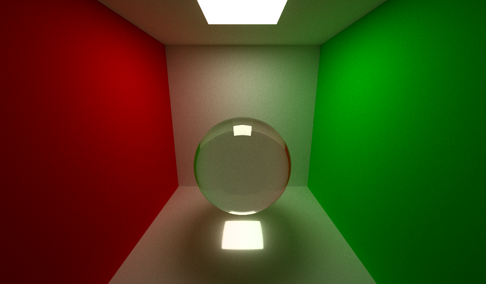
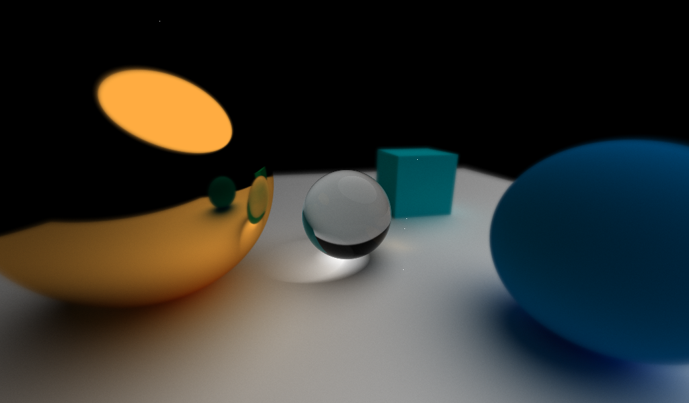
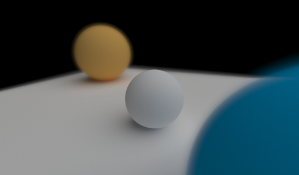
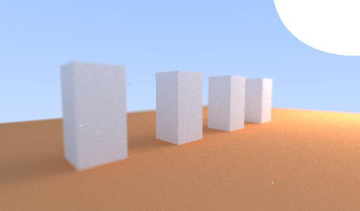
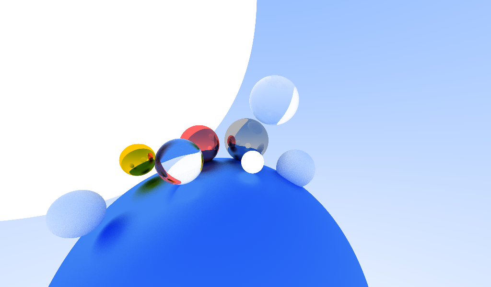

# Rey Treycer
a simple ray tracer running on CPU i made when bored
## build dependencies
- [SDL2](https://www.libsdl.org/)
- [imgui](https://github.com/ocornut/imgui) and [stb](https://github.com/nothings/stb), which are availabled as submodules
## build examples
- cd into `./examples` then run `make all`  
all generated images are on `./examples/imgs`
> [!WARNING]  
> `gui.h` is very messy and may has bad practises, open it as your own risk!
## usage
i will add this tomorrow i swear
## known bugs
havent found any, yet.
## TODO
- [ ] remake smoke
- [ ] add real matrix maths
- [ ] add BVH
- [ ] add more material options: normals/roughness based on image
- [ ] remove trash codes

## gallery

    
    
    
    
    
    

## learning resources
- https://raytracing.github.io
