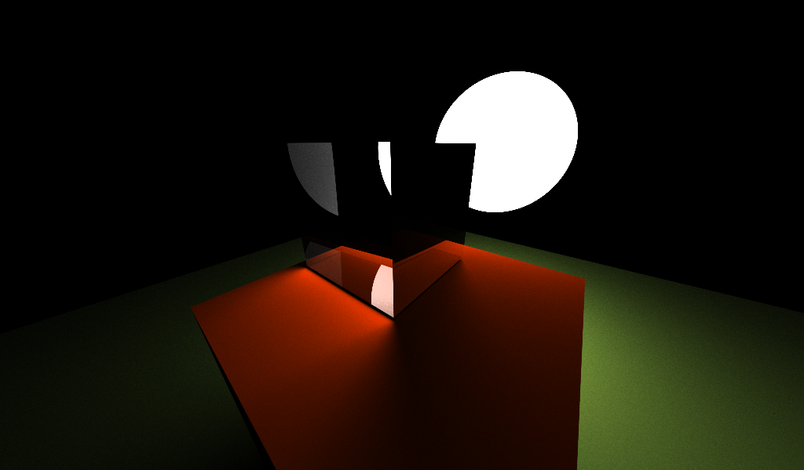
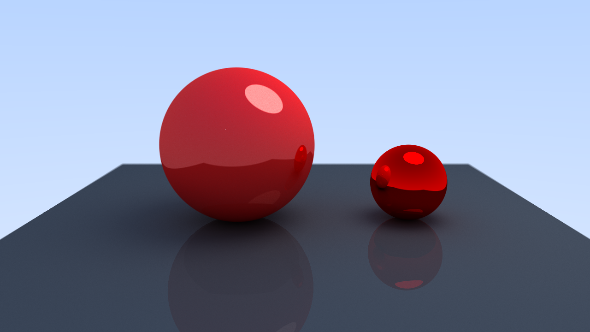
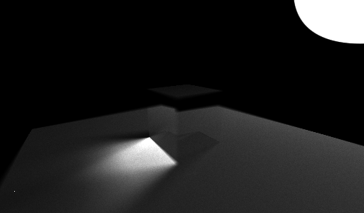
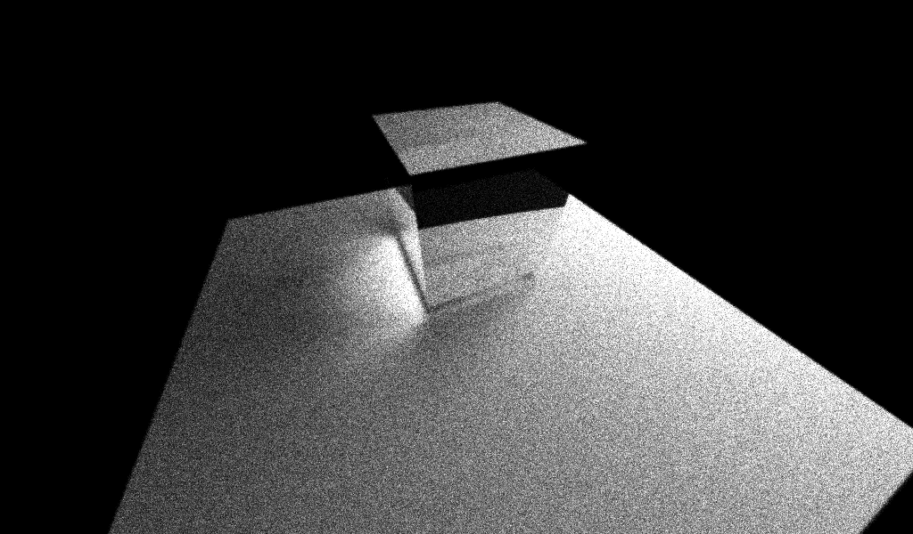
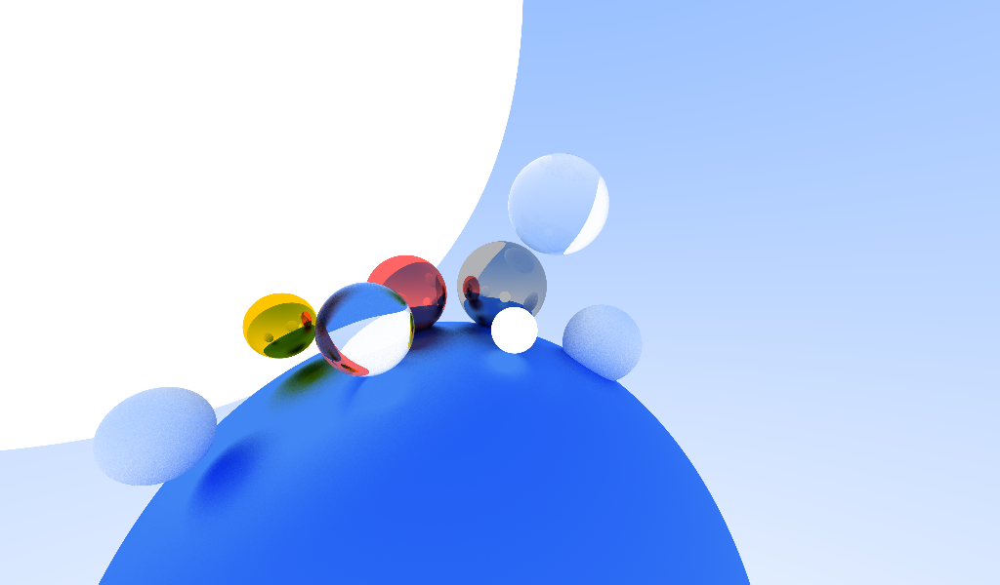

# reytreycer

A simple ray tracer for learning purpose
## Dependencies
* [Dear ImGui](https://github.com/ocornut/imgui)
* [stb](https://github.com/nothings/stb)
## build
clone all dependencies to the repo folder
then run `make`
## Gallery

    
    
    
    
    
    

