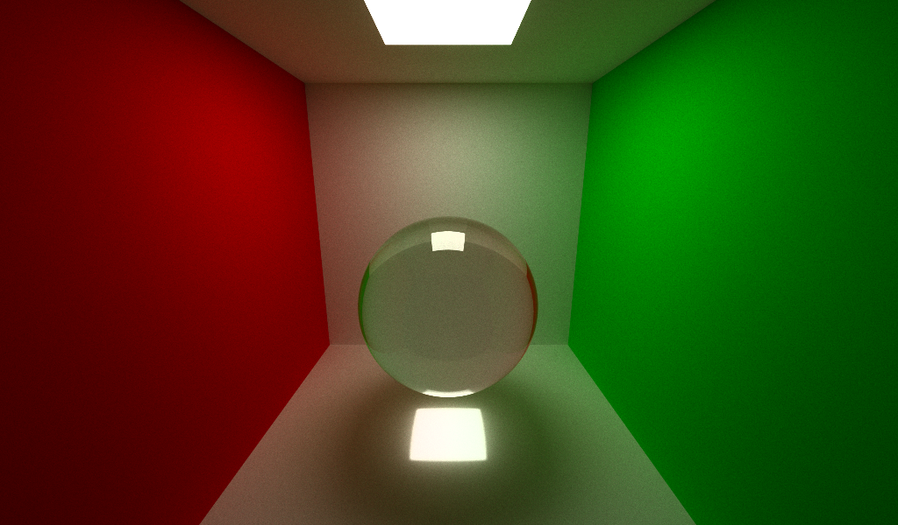
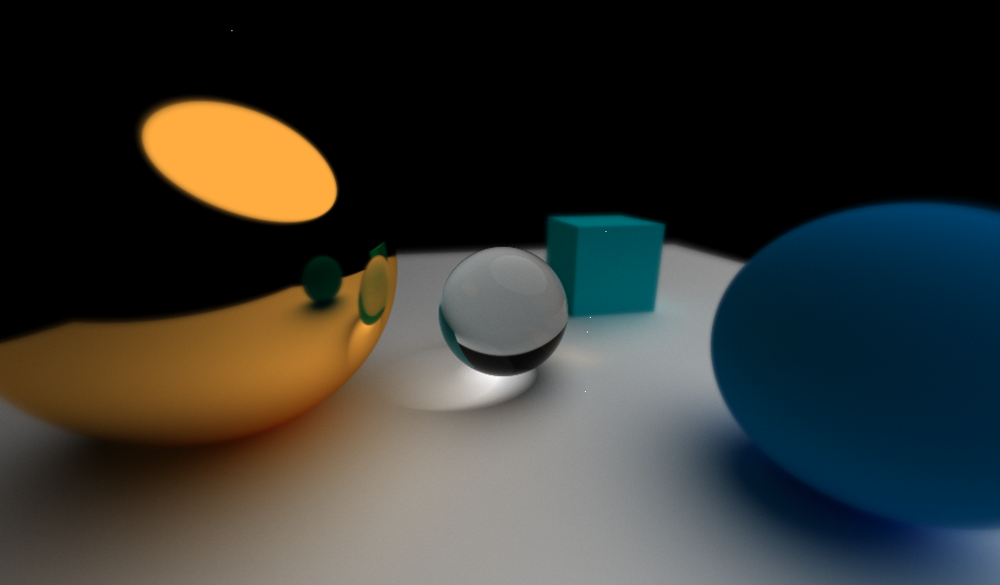
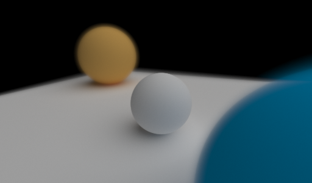
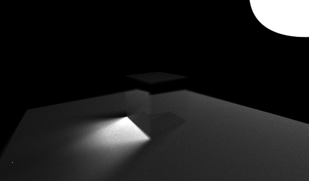
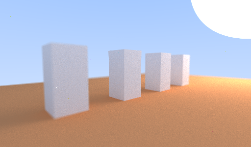

# Rey Treycer
a simple header only ray tracer library running on CPU i made when bored
> [!NOTE]  
> the library can only render the image and store it on memory. to save it as file you need to use external library. see `examples/image.h` for how it is done using `stb`.
## examples
to build the examples on `./examples` you will need  
- [SDL2](https://www.libsdl.org/)
- [imgui](https://github.com/ocornut/imgui) and [stb](https://github.com/nothings/stb), which are availabled as submodules
  
to build just  
```
cd examples
make all

```  
and then `./bin/gui` or `./bin/no-gui`
> [!NOTE]  
> you can add `cornell`, `textures` or `all` as argument when running the binaries to switch default scene
> all generated images are on `/examples/images`
## TODO
- [ ] remake smoke
- [ ] add real matrix maths
- [ ] add BVH
- [ ] add more material options: normals/roughness based on image
- [ ] remove trash codes

## gallery
<p>
    
    
    
    
    
    
</p>
## learning resources
- https://raytracing.github.io
